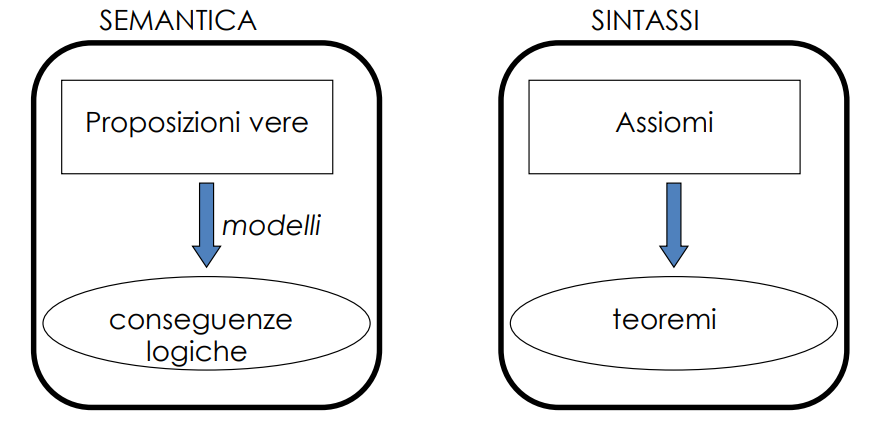

### Il ragionamento e la Logica

**Cos'è il ragionamento?** Il ragionamento è il processo mentale con cui si **trae una conclusione a partire da certe premesse** o informazioni.
- È un’attività dinamica e può essere corretta o sbagliata.
- Serve per risolvere problemi, prendere decisioni, **trarre inferenze**.
- Può avvenire in diversi modi: deduttivo, induttivo, abduttivo, per analogia, ecc.
- È come il “motore” che lavora con ciò che sai per arrivare a ciò che non sai (o credi di sapere).

**Cos'è la logica?** La logica è il sistema formale (insieme di regole) che **definisce quando un ragionamento è corretto**.
- Si occupa della struttura degli argomenti, non del contenuto.
- Può essere formale (logica proposizionale, predicativa) o informale (logica del linguaggio naturale).
- È usata per valutare se la conclusione segue logicamente dalle premesse.
- **La logica è la “grammatica” del ragionamento**: stabilisce le regole su come “giocare bene” con le idee.

**Classificazioni**:
- **Ragionamento deduttivo** (sillogismo aristotelico – logica deduttiva):
    - Da: Tutti gli uomini sono mortali e Socrate è un uomo -> allora: Socrate è mortale
    - Corretto, ma **non ci consente di “imparare” nuova conoscenza.**

- **Ragionamento induttivo** (apprendimento, deduzione inversa)
    - Dall'osservazione di svariati uccelli che volano allora Tutti gli uccelli volano (e i pinguini?).
    - Produzione di conoscenza “nuova”, **a scapito della correttezza**.

- **Ragionamento ipotetico o abduttivo** (duale del deduttivo):
    - Dall’osservazione della morte di Socrate e sapendo che Tutti gli uomini sono mortali ipotizza che Socrate è un uomo. (e se fosse un gatto?).
    - Risale alle cause mediante l’osservazione degli effetti a scapito della correttezza.

- **Ragionamento per analogia** (metaforico, case-based)
    - Non richiede un modello o molti dati, ma utilizza il principio di somiglianza. Socrate e Giovanni si “assomigliano” e Socrate ama la filosofia allora: Giovanni ama la filosofia.
    - K-Nearest-Neighbor e Support Vector Machine (SVM).
    - Utilizzo di vincoli, probabilità, statistica (teorema di Bayes)

**Nota**: Con inferire ci si può riferire a deduzione, induzione, abduzione... insomma, è l’ombrello sotto cui stanno tutti i tipi di ragionamento.

**Nota 2**: Prolog fa solo inferenze deduttive, e quindi si ha la certezza della correttezza


### Rappresentazione della conoscenza
**Knowledge base (KB)** = insiemi di sentenze scritte in un **linguaggio formale**.
- Le risposte devono “derivare” dalla KB.
- notare che la conoscenza è scritta in un linguaggio formale

**Inference engine**: strutture dati ed algoritmi per utilizzare la KB e arrivare ad una risposta.
- in sostanza è un manipolatore (ricerca e sostituzione) di simboli (base di conoscenza)
- interessante: quando si sceglie un linguaggio per rappresentare la conoscenza, questo linguaggio si porta dietro una espressività che influisce su come questa conoscenza viene utilizzata dall'inference engine per "il ragionamento"

Consideremo come linguaggio formale la **logica dei predicati del primo ordine**: 
- sia come linguaggio di rappresentazione della conoscenza
- sia come metodo di ragionamento (inferenza).


## Logica dei Predicati
Il linguaggio della logica dei predicati del primo ordine è definito da:
- una sintassi, che stabilisce le caratteristiche strutturali del linguaggio formale (mediante una grammatica) senza attribuire alcun significato ai simboli;
- una semantica, che interpreta le frasi sintatticamente corrette del linguaggio. Si dà una interpretazione alle formule **stabilendo se una frase è vera o falsa**.


### Sintassi
Alfabeto, che consiste di cinque insiemi:
- l'insieme dei simboli di **costante**, C;
    - singole entità del dominio del discorso.
    - Es. “maria”, “giovanna”, “3” -> iniziale minuscola

- l'insieme dei simboli di **variabile**, V;
    - entità non note del dominio,
    - Es. X, Y -> iniziale maiuscola

- l'insieme dei simboli di **funzione**, F;
    - generalmente n-aria
    - individua univocamente un oggetto del dominio mediante una relazione tra altri “n” oggetti del dominio.
        - serve a rappresentare operazioni o **mappature tra elementi del dominio**
    - Es. madre(maria), somma(X, Y)
    - Importante: le funzioni, in logica, non presuppongono alcun concetto di valutazione

- l'insieme dei simboli di **predicato** (o relazione), P;
    - generalmente n-ari
    - generica relazione, che **può essere vera o falsa** fra “n” oggetti del dominio del discorso.
        - esprime una proprietà o una relazione tra oggetti.
    - Es. parente(giovanna, maria)
    - **NB**: si differenziano rispetto alle altre entità sintattiche, in quanto solamente a loro si applica la domanda "è vero/falso?"  
        - implicano valutazione

- i **connettivi logici**
    - es: negazione, congiunzione/disgiunzione, implicazione, ..., quantificatori (esistenziali e universali)
    - congiunzione -> ^ -> and
    - disgiunzione -> v -> or

**OSS IMPORTANTE**: pensa al predicato bello(io), c'è un problema... che cosa significa bello? Cambia per tutti e **la logica non lo definisce**


Date queste definizioni principali possiamo definire:
- **Termine** (definito ricorsivamente):
    - in sostanza tutto cio che si riduce ad un elemento del dominio
    - una variabile è un termine;
    - una costante è un termine;
    - se f è un simbolo di funzione n-aria e t1,...tn sono termini, allora f(t1,...,tn) è un termine (composto).

- **Atomo** o formula atomica:
    - un predicato con dentro dei termini
    - la minima cosa valutabile come T/F
    - l’applicazione di un simbolo di predicato n-ario p a n termini t1,...,tn: p(t1,..,tn). 

**Formule ben formate (fbf)**: frasi sintatticamente corrette del linguaggio.
- combinazione di formule atomiche, mediante i connettivi e i quantificatori.

**Letterale**: fbf atomica o la sua negazione.


- **Formule chiuse**: fbf che non contengono alcuna variabile libera. Ad esempio, le formule (E1), (E2) ed (E3) sono fbf chiuse. Nel seguito considereremo solo formule fbf chiuse.
- **Formule ground**: formule che non contengono variabili. Ad esempio la formula (E1) è una formula “ground”.
- **Varianti**: una formula F2, ottenuta rinominando le variabili di una formula F1, è detta variante di F1.

### Semantica
```bisogna capire implicazioni ed equivalenze come funzionano```
l'implicazione locica (->) è diversa in linguaggio naturale (se -> allora) rispetto a ciò che si intende in logica
- se chesani <18 anni, allora ha il biglietto gratis sull'autobus -> vero 


Abbiamo una difficoltà, accennata nell'osservazione importante di sopra. 
- Con la semantica vogliamo dare un significato ai simboli;
- Ogni sistema formale è la modellizzazione di una certa realtà (ad esempio la realtà matematica).
- Un’interpretazione è la costruzione di un rapporto fra i simboli del sistema formale e tale realtà (chiamata anche dominio del discorso). 

```Ogni formula atomica o composta della logica dei predicati del primo ordine può assumere il valore vero o falso in base alla frase che rappresenta nel dominio del discorso.```

Come risolvere?


**interpretazine**
Dato un linguaggio del primo ordine L, un'interpretazione per L definisce un dominio non vuoto D e assegna:
- a ogni simbolo di costante in C, una costante in D;
- a ogni simbolo di funzione n-ario F, una funzione:
    - F: D^n -> D;
- a ogni simbolo di predicato n-ario in P una relazione in D^n, cioè un sottoinsieme di D^n.
    - In altre parole, la relazione associata al predicato n-ario 𝑃 contiene tutte le n-uple ordinate di elementi di 𝐷 per cui il predicato 𝑃 è "vero

Esempio: Linguaggio del primo ordine, L, nel quale si ha una costante “0”, un simbolo di funzione unaria “s” e un simbolo di predicato binario “p”.
- Interpretazione I1, D: numeri naturali.
    - "0" rappresenta il numero zero.
    - "s" rappresenta il successore di un numero naturale
    - "p" rappresenta la relazione binaria "<="
- Interpretazione I2, D: numeri interi negativi.
    - "0" rappresenta il numero zero.
    - "s" rappresenta il predecessore di un numero naturale
    - "p" rappresenta la relazione binaria "<="

**modelli**
Data un'interpretazione I e una fbf F, **I è un modello per F se e solo se F è vera in I**.
- Esempio: Per la fbf: per ogni Y p(0,Y) l’interpretazione I1 è un modello, mentre I2 non lo è.

Una **fbf è soddisfacibile** se e solo se è vera almeno in una interpretazione,
- ovvero se esiste almeno un modello per essa.

Una fbf che ha valore vero per tutte le possibili interpretazioni è detta **logicamente valida**.
- ogni possibile interpretazione è un modello

Un insieme di formule del primo ordine S è soddisfacibile, se esiste una interpretazione I che **soddisfa tutte le formule di S**
- I è un modello per ciascuna formula di S.
- Tale interpretazione è detta modello di S.

**conseguenza logica**
Una formula F segue logicamente (o è conseguenza logica) da un insieme di formule S (e si scrive S |= F), se e solo se **OGNI interpretazione I che è un modello per S, è un modello per F**
- idea: teorema di pitagora è conseguenza logica dei 5 assiomi della geometria euclidea 

```**NMB**: ragionare per conseguenze logiche è ciò che ci fà scavallare il problema dell'interpretazione! Possiamo lasciare stare l'interpretazione, basta essere daccordo sull'insieme di formule S di partenza e da questo siamo sicuri che qualunque risultato ottenuto è per forza vero anche per altre interpretazioni (che sono un modello per gli assiomi di partenza)```
- attenzione bisogna però dimostrare che ogni modello di S è un modello anche per F

**Proprietà**:
- Se una fbf F segue logicamente da S (S |= F), allora l'insieme S U {~F} è insoddisfacibile.
    - ogni modello di S è un antimodello di F e viceversa
- Viceversa, se S U {~F} è insoddisfacibile (e S era soddisfacibile), allora F segue logicamente da S. 
    - significa che ogni interpretazione che rende valida S non va bene per ~F, e viceversa
    - dimostrazioni per assurdo

I **sistemi di refutazione** si basano su questa proprietà:

```per dimostrare S |= F, supposto S soddisfacibile, è sufficiente dimostrare che S U {~F} è insoddisfacibile.```

In pratica l'idea è voler dimostrare che F è conseguenza logica, mostrando che aggiungendo all'insieme di partenza ~F il mio nuovo insieme diventa insoddisfacibile (se è vero ~F è falso il resto e viceversa)

Problema interessante:
Determinare se una formula F segue logicamente da S (ovvero che S È {~F} è insoddisfacibile) **utilizzando solo semplici trasformazioni sintattiche** (regole di inferenza), possibilmente ripetitive e quindi automatizzabili, e non introducendo concetti quali significato o interpretazione o modello.

**conclusione**: è più semplice lavorare a livello sintattico (sostituzione di simboli) piuttosto che semantico (significati, interpretazioni, modelli)



Parte Semantica
- "Proposizioni vere": sono affermazioni che sono **vere in un certo modello** (es. "Tutti gli esseri umani sono mortali").
- "modelli": indica che la verità delle proposizioni è valutata rispetto a una certa interpretazione 
- "conseguenze logiche": sono le affermazioni che devono essere vere, dato che le proposizioni iniziali lo sono in tutti i modelli in cui esse sono vere.
- Questo è il significato semantico di "essere conseguenza logica": vale in tutti i modelli in cui valgono le premesse.

Parte Sintattica
- "Assiomi": sono proposizioni date come punto di partenza in un sistema formale (non si discutono, si accettano).
- "teoremi": sono le proposizioni che possiamo dedurre dagli assiomi con **regole di inferenza**.
- Questa è la parte sintattica: si basa su regole formali, non sul significato delle proposizioni.


### Regole di inferenza

**Teoria assiomatica**: 
- formule ben formate ritenute vere: assiomi
- **criteri di manipolazione sintattica**: regole di inferenza derivano fbf da fbf
- Scopo: produrre nuove formule sintatticamente corrette (teoremi).


- voglio dimenticarmi di che cosa significano i simboli (semantica), voglio solo delle regole con cui posso arrivare ad un risultato vero/falso 
- esempio dell'aritmentica delle elementari (3+3 lo sostituisco con 6 e non mi preoccupo più di tanto)

- modus ponens
- specializzazione
- abduzione 
    - ipotizzo A se vedo B, A->B 
    - diagnosi, ipotesi
    - come gia detto sopra, non sempre corretto
- induzione
    - osservando A(t1), A(t2), ... A(tn) dico: per ogni x A(x)
    - generalizzare concetti da esperienze
    - anche questo non sempre corretto


**Derivabilità**
- **Dimostrazione**: sequenza finita di fbf f1, f2, ..., fn, tale che ciascuna fi o è un assioma oppure è ricavabile dalle fbf precedenti **mediante una regola di inferenza**.
- **Teorema**: L'ultima fbf di ogni dimostrazione.
- **Prova del teorema**: sequenza di regole di inferenza applicate

Una fbf F è derivabile in una teoria T (T |- F) se esiste una sequenza di fbf f1, f2, ..., fn, tale che
- fn = F (teorema) e
- per ogni i, o fi è un assioma di T, oppure è ricavabile dalle fbf precedenti mediante una regola di inferenza di T (dimostrazione).


**Decidibilità**
Teoria decidibile: teoria per la quale esiste un metodo meccanico per stabilire se una qualunque fbf è un teorema o non lo è (in un numero di passaggi finito).
- Il calcolo dei predicati del primo ordine non è decidibile, ma semidecidibile: se una formula è un teorema, esiste un metodo meccanico che la deriva in un numero finito di passi. Se invece la formula non è un teorema, non è garantita, in generale, la terminazione del metodo meccanico 


**Correttezza e completezza**
Una teoria assiomatica è corretta se i teoremi dimostrati seguono logicamente dagli assiomi della teoria.

Una teoria assiomatica è completa se tutte le fbf che seguono logicamente dalla teoria possono essere dimostrati come teoremi della teoria.

Se T è **corretta e completa** è garantita l’equivalenza tra l'aspetto sintattico e semantico
- T |- F <-> T|= F

- correttezza (soundness): la derivazione produce solo sentenze che sono conseguenza logica.
    - abduzione non è corretta
- completezza (completeness): la derivazione puo’ produrre tutte le conseguenze logiche
    - Le regole di inferenza sono complete; tuttavia, **il problema della derivabilità è indecidibile**:
        - non esiste un algoritmo generale che applica le regole di inferenza che si ferma sempre

Ancora in altri termini:
- correttezza: ogni formula derivata è una conseguenza logica
- completezza: ogni conseguenza logica può essere derivata

**Conclusione**: se la teoria è corretta e completa: allora possiamo lavorare solo sul piano sintattico (**CHIEDI A CHESANI**)


**Monotonicità**
Una teoria T è monotona se aggiungendo degli assiomi, quest'ultimi non mi invalidano i teoremi che ho gia ottenuto precedentemente
- Sia Th(T) l'insieme dei teoremi derivabili da T. Allora T è monotona se Th(T) sottoinsieme Th(T U H) per qualunque insieme aggiuntivo di assiomi H.

**Esistono regole di inferenza non monotone.** Ad esempio la regola nota come Assunzione di Mondo Chiuso (Closed World Assumption, CWA):

se una formula atomica ground A non è conseguenza logica di una teoria T, ~A si può considerare un teorema di T.
- Se alla teoria T si aggiunge l'assioma A, non si può più derivare ~A, da cui segue la non monotonicità del sistema di inferenza.

Assunzione del mondo chiuso:
"ragionamenti per DB", se non c'è nel DB allora è falso
- il DB è il mio mondo


### Sommario
- Gli agenti logici applicano inferenze a una base di conoscenza per **derivare nuove informazioni** (se non facciamo induzioni/abduzioni come facciamo a derivare nuove informazioni?).
- Concetti base della logica come linguaggio per la rappresentazione della conoscenza e ragionamento:
    - sintassi: struttura formale delle sentenze
    - semantica: verita` di sentenze rispetto ad interpretazioni/modelli
- conseguenza logica (entailment): sentenza necessariamente vera data un’altra sentenza
- inferenza: derivare (sintatticamente) sentenze da altre sentenze
    - correttezza (soundness): la derivazione produce solo sentenze che sono conseguenza logica.
    - completezza (completeness): la derivazione puo’ prdurre tutte le conseguenze logiche.