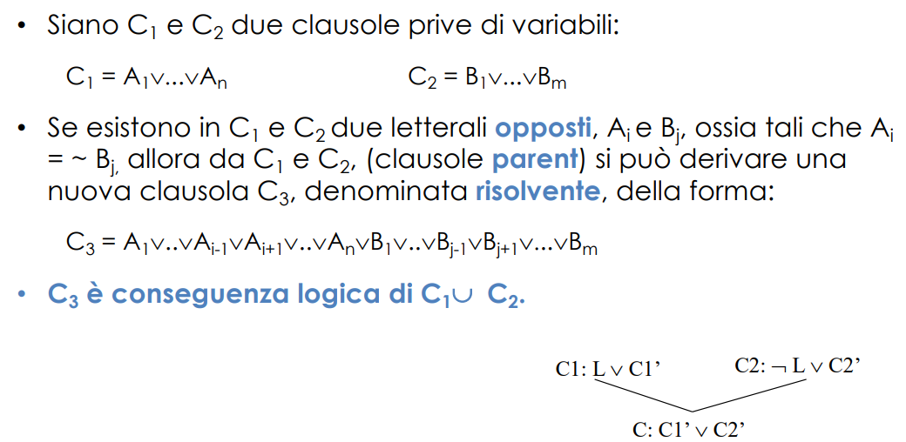

E’ la logica:
- più semplice;
- non molto espressiva;
- non possiamo esprimere variabili 
    - (solo enumerazione di tutti gli elementi);
- povera per rappresentare basi di conoscenza.

# Principio di risoluzione (importantissimo)
Vedremo la dimostrazione basata su **Risoluzione**
- (corretta e completa per clausole generali)

Sistema di deduzione per la logica a clausole per il quale valgono interessanti proprietà.
- Regola di inferenza: **Principio di Risoluzione** che si applica a teorie del primo ordine in **forma a clausole**. 
- meccanismo più generale del modus ponens (che, a quanto pare, non è completo) (vedi come si riscrive l'implicazione)
- È la regola di inferenza base utilizzata nella programmazione logica

**Forma a clausole**
Una clausola è una **disgiunzione di letterali** (cioè atomi negati e non negate), in cui tutte le variabili sono **quantificate universalmente in modo implicito**. 
- Una clausola nella quale non compare alcun letterale, sia positivo sia negativo, è detta **clausola vuota interpretata come contraddizione**

## Principio di risoluzione in logica proposizionale
in logica proposizionale le clausole non hanno variabili (non sono ammesse)

- in sostanza, si semplificano gli atomi opposti in due clausole per produrre una terza clausola (**risolvente**) che è l'unione delle prime due
- **NB**: la conseguenza logica si applica in una direzione, tutte i modelli della mia teoria sono modelli anche per la mia fbf, non vale che un modello per la fbf è anche un modello per la teoria
- faremo esercizi su sta roba

**DIMOSTRAZIONE PER CONTRADDIZIONE ATTRAVERSO LA RISOLUZIONE**
ricorda: se voglio dimostrare un teorema F partendo da degli assiomi H, derivando da H U {~F} la contraddizione logica, si dimostra che F è un teorema della teoria (assurdo).
- in questo caso, la regola di inferenza con cui deriviamo è la risoluzione!
- se genere la clausola vuota dimostro la contraddizione

### algoritmo di robinson

...

fa tutti contro tutti

se scegliamo un sottoinsieme di tutti contro tutti cominciamo ad avere una strategia di risoluzione

**forward chaining e backward chaining**
Horn Form (sottinsieme della logica proposizionale)
- KnowledgeBase = congiunzione di clausole di Horn

Clausole di Horn
- Atomi, o
- (congiunzione di atomi) -> (implicazione) atomo (singolare)
- il modus ponens diventa completo per questa forma

La logica proposizionale è povera dal punto di vista espressivo... cosa significa?
- non ho variabili e predicati
- devo enumarare tutti i simboli per ogni soggetto 
    - variabili proposizionali
    - che però non sono variabili, si chiamano così solo perchè possono essere direttamente vere o false
    - praticamente algebra booleana

Per questo utilizziamo la logica dei predicati del primo ordine

# Sommario
- La risoluzione è completa per la logica proposizionale
- Forward, backward chaining sono complete per le clausole di Horn
- La logica proposizionale è povera dal punto di vista espressivo, e quindi usiamo la logica del primo ordine